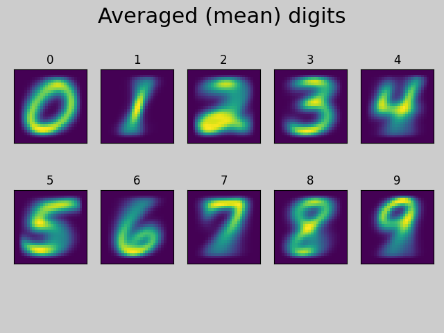
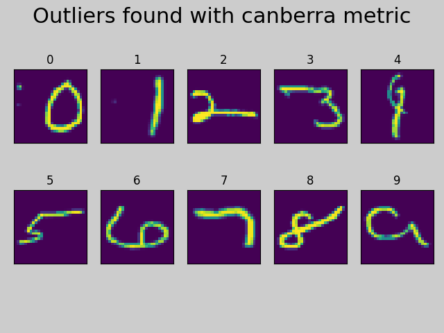
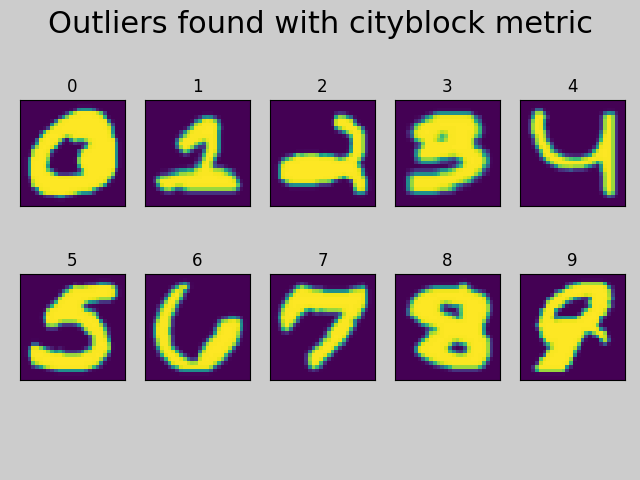
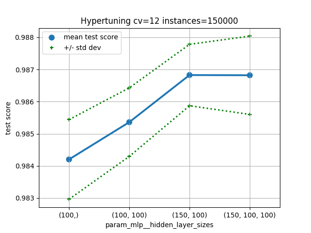
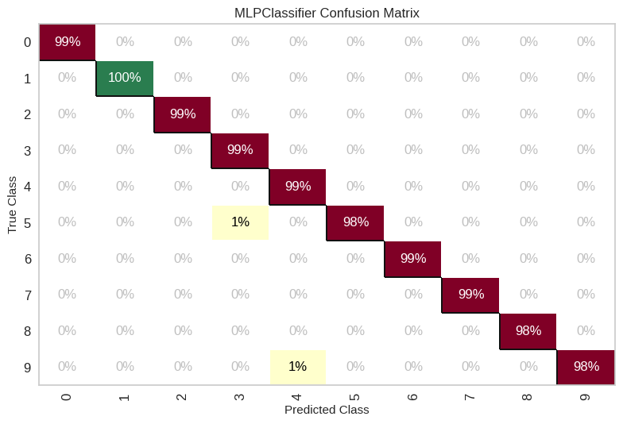
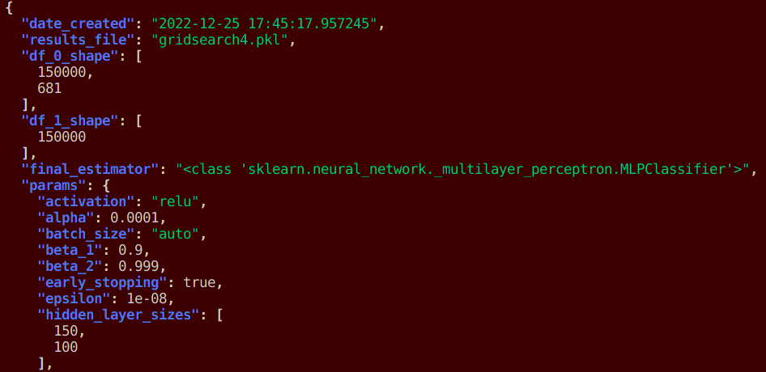

# MNIST
* Data science pipeline applied to a classic machine learning benchmark dataset--MNIST handwritten digits

# Exploratory Data Analysis
### Averaged representations 


### Outliers extracted using matrix-matrix distances from the mean




# Hyperparameter tuning the neural network


# Model Results
* The confusion matrix shows accuracy prediction for each digit, and which digits are most commonly mistaken for others
* The F1 multiclass weighted score is 98.8
* 3 is most commonly mispredicted as 5 and 4 is most commonly mispredicted as 9


# Metadata 
* Scripts log all the important machine learning metadata in json format


# Usage
* Installing the pip package *python-mnist* puts the data downloading script *emnist_get_data.sh* in your python bin directory. e.g 
```ls PYTHON_BIN_DIR | grep mnist```
* Run tests with ```pytest tests/*```
* View json metadata with jq utility ```jq . models/*.json```
* Project **plan document** found in [plan.md](plan.md)
